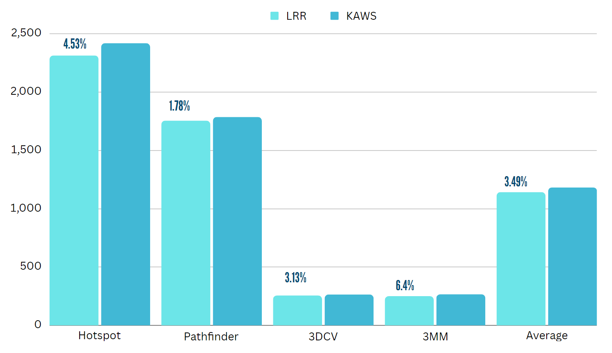
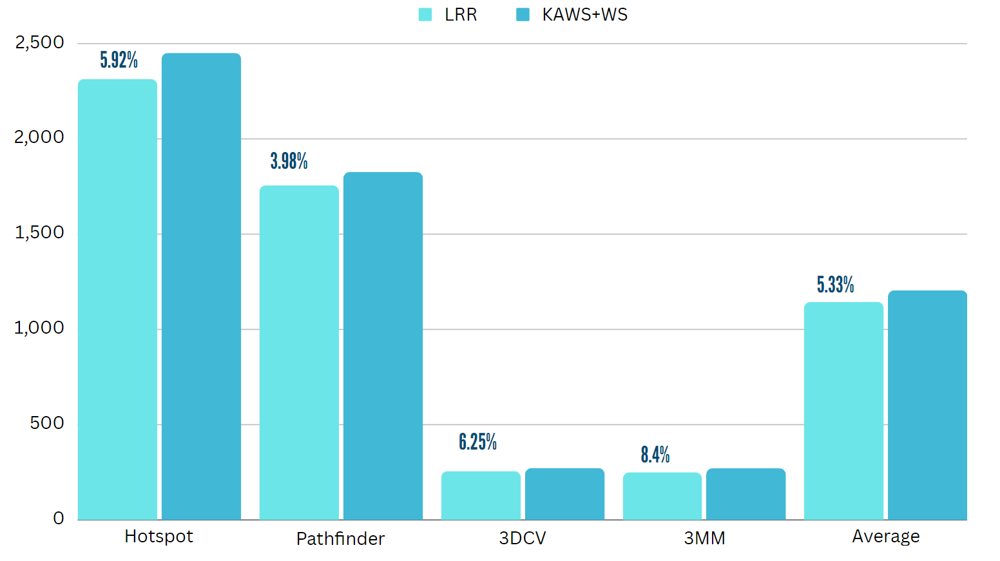

**KAWS**

**T E S T I N G**

**PREPARED BY**

Saurav Jami (21CS02012) Kumar Saurabh (21CS02010)
Lalit Mohanani (21CS02006) Sagnik Basu (21CS02004) 
Sanjana Yelukati (21CS01067)

**IPC tabulation**

After running the benchmarks provided in the research paper, we obtained the corresponding IPC values as shown in the table below: 

|Benchmarks|LRR|KAWS|KAWS+WS|
| - | - | - | - |
|Hotspot|2314|2419|2451|
|Pathfinder|1756|1787|1826|
|3DCV|256|264|272|
|3MM|250|266|271|
|Avg|1144|1184|1205|

**Graphs**

The corresponding graphs for lrr vs. kaws and that for lrr vs. kaws+ws are given below :-   

We observe that kaws provides a susceptible improvement over the standard lrr svcheduler, however that improvement is accentuated by adding warp sharing feature to that as well.
